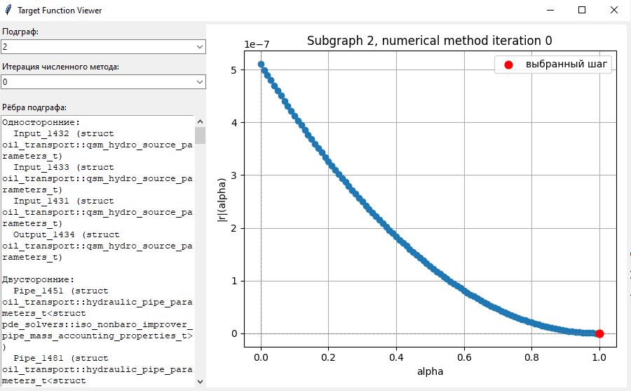
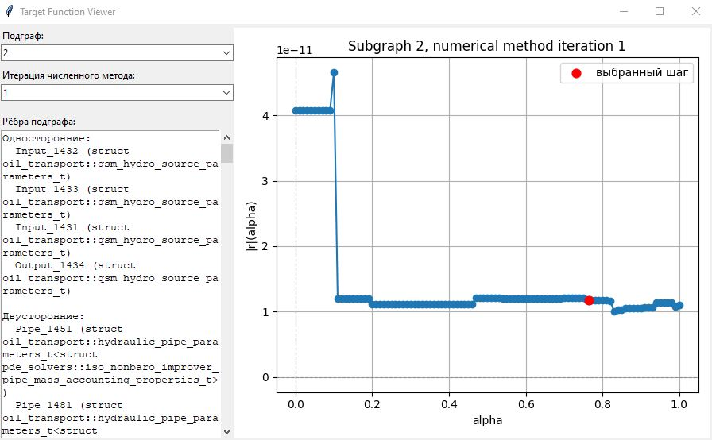
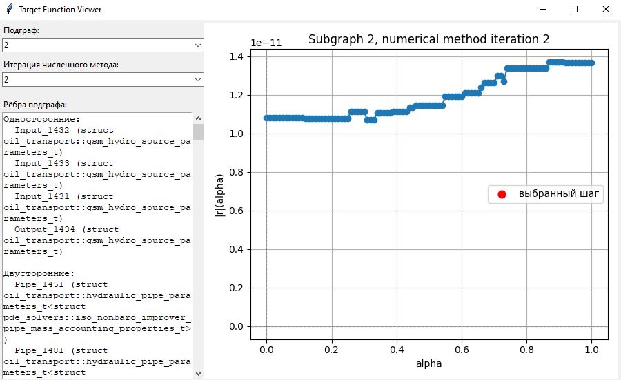
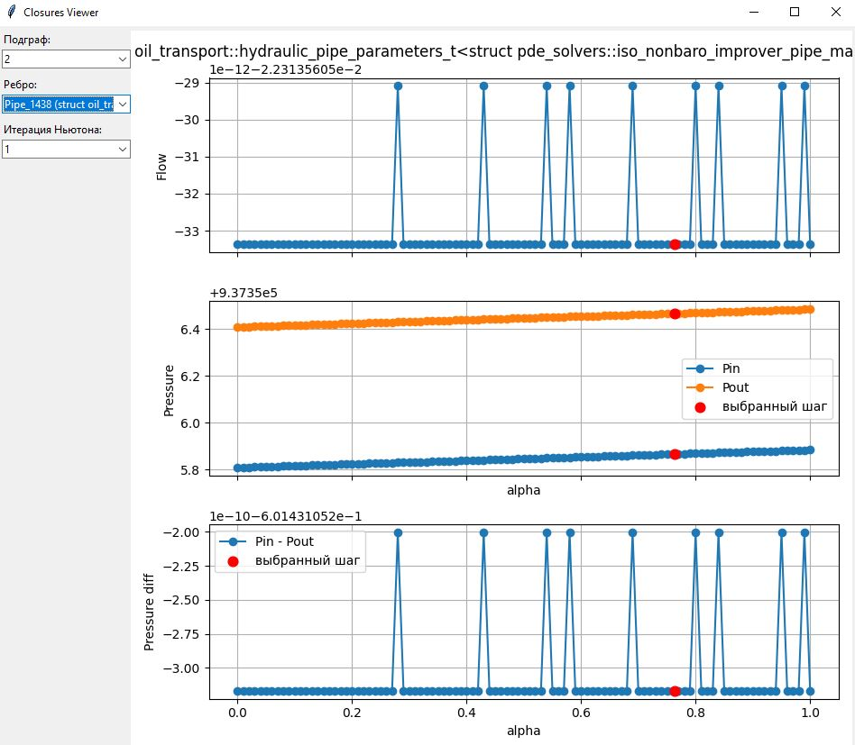
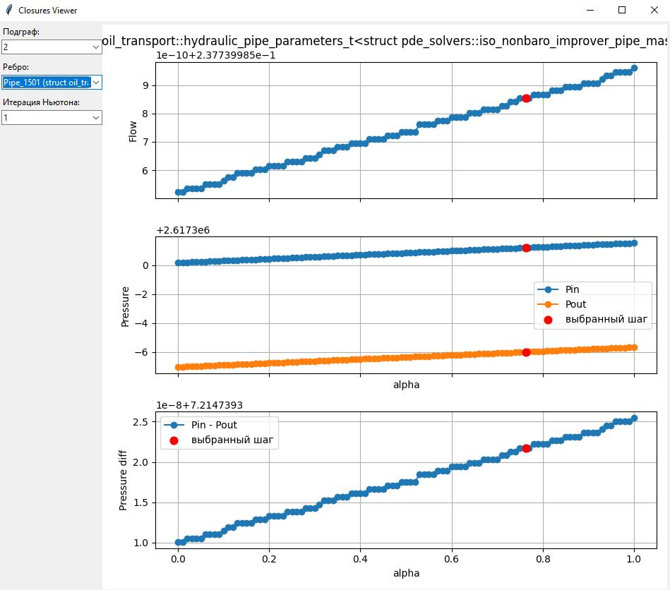
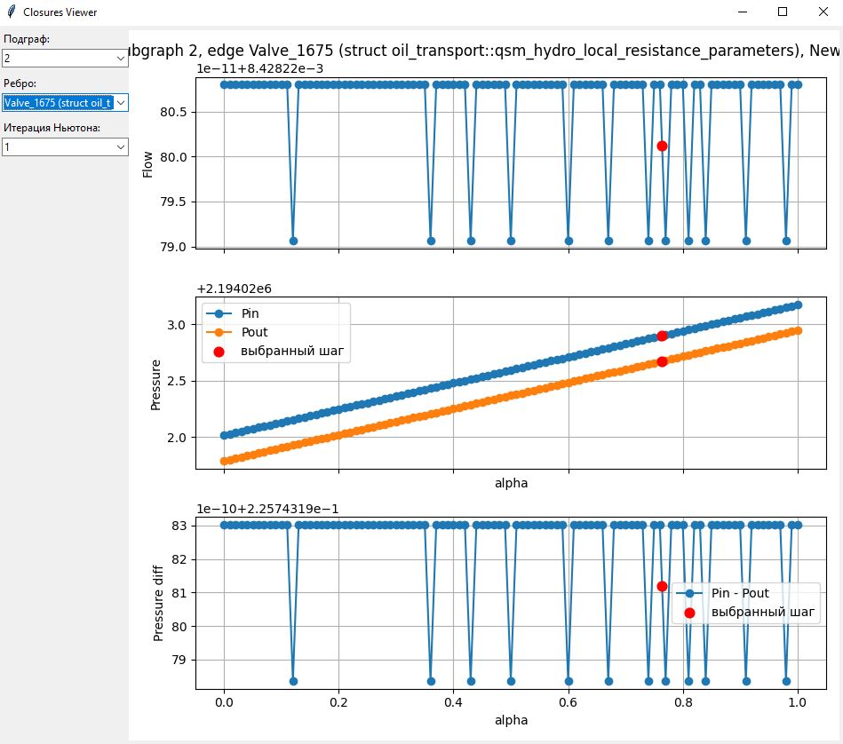

# Предельная достижимая точность расчёта при использовании численных методов

При итерационном решении нелинейных уравнений необходимо различать два уровня точности: погрешность предметной области и погрешность численного расчёта.

В прикладной задаче всегда можно оценить порядок величин, которые считаются малыми, т.е. задать приемлемую **погрешность предметной области**. Критерий сходимости, сформулированный в терминах предметной области, оперирует конечной целевой точностью с точки зрения пользователя. Эта погрешность должна быть заведомо выше погрешности численного расчёта в формате `double`.

Не любая практическая задача допускает задание требуемой погрешности по величине целевой функции. Так, например, при выполнении расчёта гидравлических режимов объектов нефтегазовой отрасли методом узловых давлений (МД) аргументом являются значения давления, а целевой функцией — небаланс расходов. При этом характерные давления от объекта к объекту варьируются в меньшем диапазоне, чем характерные расходы. В случае одновременного присутствия потоков с существенно различными порядками расходов задание погрешности по величине ц.ф. приведёт к существенной погрешности расчёта для малых расходов.

Для преодоления этой проблемы в качестве критерия завершения итераций используют малую величину приращения аргумента (давления). В основе подхода — предположение, что малому приращению аргумента соответствует малое приращение значения целевой функции, а значит, дальнейшие итерации не улучшат результат сверх уже достигнутой точности. И вновь порядок малого приращения аргумента определяется погрешностью предметной области.

На практике при требовании чрезмерно малой погрешности предметной области наблюдается нефизичное поведение целевой функции, потеря гладкости в диапазоне малых значений функции. Требование на малое приращение аргумента может приводить к тому, что соответствующее приращение значения целевой функции окажется ниже порога разрешимости вещественной арифметики `double` - ниже **границы численной точности**.

## Влияние порога разрешимости численной арифметики на технологические расчёты

На примере типа `double` рассмотрим причину возникновения погрешностей, приводящих к выходу за границу численной точности.

Тип `double` (IEEE 754, 64 бита) обеспечивает хранение любого числа $x$ с относительной погрешностью не более машинного эпсилона $\varepsilon_\text{machine} \approx 2.22 \times 10^{-16}$. Для результатов арифметических операций такой гарантии нет.

Так, при вычислении разности двух близких чисел возникает явление потери значащих цифр. Классический пример из [1, §4]: вычисление $y = 70 - \sqrt{4899}$ при четырёх десятичных разрядах даёт $y \approx 0.01$, тогда как алгебраически эквивалентная форма $y = \dfrac{1}{70 + \sqrt{4899}}$ даёт результат на несколько порядков точнее $y \approx 0.007143$. Разница — в том, что первая форма требует вычитания близких чисел (70 и 69.99), а вторая — нет.

Если $P_\text{in}$ и $P_\text{out}$ — два числа одного порядка величины $M$, а их разность $\Delta P = P_\text{in} - P_\text{out}$ на $k$ порядков меньше, то:

$$
\begin{aligned}
\sigma_{\text{операнда}} &\sim M \cdot \varepsilon_\text{machine} \\
\sigma_{\Delta P} &\sim 2M \cdot \varepsilon_\text{machine} \\
\frac{\sigma_{\Delta P}}{|\Delta P|} &\sim \frac{2M \cdot \varepsilon_\text{machine}}{|\Delta P|} = 2 \cdot 10^{k} \cdot \varepsilon_\text{machine}
\end{aligned}
$$

где $\sigma_{\text{операнда}}$ — абсолютная погрешность каждого операнда, $\sigma_{\Delta P}$ — абсолютная погрешность результата, отношение $\sigma_{\Delta P}/|\Delta P|$ — относительная погрешность результата.

Таким образом, при разнице в $k$ порядков между операндами и результатом относительная погрешность результата деградирует в $10^{k}$ раз по сравнению с $\varepsilon_\text{machine}$. 

Подобное поведение свойственно всем способам представления чисел с плавающей точкой. Увеличение разрядности лишь приведёт к сокращению относительной погрешности, но не устранит её.

## Демонстрация потери значащих цифр при решении КЗП с помощью МД

Покажем потерю точности на примере решения уравнений МД методом Ньютона-Рафсона.

В методе узловых давлений аргументом итерационного метода служат абсолютные давления в узлах сети. Замыкающие соотношения рёбер принимают пару $(P_\text{in},\, P_\text{out})$ и возвращают расход $Q$. Для большинства рёбер физически значимой является именно разность $\Delta P = P_\text{in} - P_\text{out}$, а не абсолютные значения.

В процессе коррекции шага при движении вдоль направления ньютоновского спуска с шагом $\alpha \in [0, 1]$ давления параметризуются линейно:

$$P_\text{in}(\alpha) = P_\text{in}^{(0)} + \alpha \cdot \Delta P_\text{in}$$

$$P_\text{out}(\alpha) = P_\text{out}^{(0)} + \alpha \cdot \Delta P_\text{out}$$

Если $|P_\text{in}| \gg |\Delta P|$, то вычисление $\Delta P(\alpha) = P_\text{in}(\alpha) - P_\text{out}(\alpha)$ для каждого $\alpha$ даёт результат с абсолютной погрешностью порядка $2 |P_\text{in}| \cdot \varepsilon_\text{machine}$, тогда как само значение $\Delta P$ на несколько порядков меньше. 

Кроме того, шаг $\alpha \cdot \Delta P_\text{in}$ не представим точно в `double`, поэтому $P_\text{in}^{(i)}$ и $P_\text{out}^{(i)}$ округляются независимо, и погрешность $\Delta P$ непостоянна вдоль $\alpha$ — она принимает несколько дискретных значений в зависимости от того, как именно округлилась каждая точка.

Рисерч выполнен в `graph_solvers` - см. тест `ResearchNumericalAccuracy.NodalSolverFallsOverNumericalAccuracy`. Диагностика МД приведена в `graph_solvers\testing\research_oilnet_out\ResearchNumericalAccuracy.NodalSolverFallsOverNumericalAccuracy`. Расчёт КЗП завершился с ошибкой, обусловленной невозможностью выбора величины шага из-за негладкого характера функции. Далее приведены графики целевой функции на последовательных итерациях.

На итерации 1 целевая функция $|r(\alpha)|$ вдоль направления спуска принимает значения порядка $1.1 \times 10^{-11}$.

Следствием является нарушение монотонности целевой функции: метод золотого сечения на итерации 1 выбирает $\alpha = 0.764$ (с $f \approx 1.2 \times 10^{-11}$), пропуская истинный минимум при $\alpha = 0.830$ (с $f = 1.009 \times 10^{-11}$). Разница между ними находится внутри зоны числового шума и не несёт физического смысла.

На итерации 2 целевая функция монотонно возрастает по всему $[0, 1]$ — минимум находится у левой границы ($\alpha = 0$), линейный поиск не может выбрать шаг, и $\alpha$ остаётся неопределённым.

Исследование поведения замыкающих соотношений отдельных элементов гидравлической цепи показало, что для некоторых элементов изменение расхода вдоль направления шага $Q(\alpha)$ не является гладкой функцией. Скачки $Q$ в замыкающих соотношениях транслируются в скачки невязки верхнего уровня.

Далее приведём несколько характерных случаев негладкой функции $Q(\alpha)$.

### Нефизичные скачки расхода через ребро-трубу

На итерации 1 численного метода для ребра `Pipe_1438` давления на концах ребра при $\alpha = 0$:

$$
P_\text{in}^{(0)} = 937\,355.808331\,\text{Па}, \quad
P_\text{out}^{(0)} = 937\,356.409762\,\text{Па}, \quad
\Delta P \approx -0.6014\,\text{Па}
$$

Отношение $|P_\text{in}| / |\Delta P| \approx 1\,558\,542$ — разница в 6.2 порядка. Теоретическая погрешность вычисления $\Delta P$:

$$
\sigma_{\Delta P} \sim 2 \cdot |P_\text{in}| \cdot \varepsilon_\text{machine}
\approx 2 \cdot 9{,}374 \times 10^{5} \cdot 2{,}22 \times 10^{-16}
\approx 4{,}16 \times 10^{-10}\,\text{Па}
$$

При изменении $P_\text{in}$ и $P_\text{out}$ в направлении шага в диапазоне $\alpha=0..1$ с шагом $0.01$ $\Delta P$ принимает ровно два значения:

$$
\begin{aligned}
\Delta P_\text{lo} &= -0.601\,431\,052\,316\,912\,\text{Па} && (92 \text{ точки из } 101) \\
\Delta P_\text{hi} &= -0.601\,431\,052\,200\,496\,\text{Па} && (9 \text{ точек из } 101) \\
\text{разброс} &= 1{,}16 \times 10^{-10}\,\text{Па}
\end{aligned}
$$

Разброс — порядка теоретической погрешности, полностью объясняется арифметикой `double`. Расход также принимает два значения:

$$
\begin{aligned}
Q_\text{lo} &= -0.022\,313\,560\,533\,366\,\mathrm{m^{3}/s} && (92 \text{ точки}) \\
Q_\text{hi} &= -0.022\,313\,560\,529\,091\,\mathrm{m^{3}/s} && (9 \text{ точек}) \\
\text{разброс} &= 4{,}28 \times 10^{-12}\,\mathrm{m^{3}/s}
\quad \left(\text{относительный: } 1{,}92 \times 10^{-10}\right)
\end{aligned}
$$

Нефизичные скачки расхода, обусловленные исключительно потерей значащих цифр в расчетах, приводят к нефизичному характеру целевой функции.

Вместо скачков расхода эффект потери значащих цифр может проявляться в дрейфе зависимости $Q(\alpha)$ вдоль направления спуска — как на рисунке.

Давления на концах ребра `Pipe_1501`:

$$
P_\text{in}^{(0)} = 2\,617\,300.166515\,\text{Па}, \quad
P_\text{out}^{(0)} = 2\,617\,292.951775\,\text{Па}, \quad
\Delta P \approx 7.2147\,\text{Па}
$$

Отношение $|P_\text{in}| / |\Delta P| \approx 362\,771$ — разница в 5.6 порядка. Теоретическая погрешность одного вычитания:

$$
\sigma_{\Delta P} \sim 2 \cdot 2{,}617 \times 10^{6} \cdot 2{,}22 \times 10^{-16}
\approx 1{,}16 \times 10^{-9}\,\text{Па}
$$

При изменении $P_\text{in}$ и $P_\text{out}$ в направлении шага $\Delta P$ принимает **33 уникальных значения** с разбросом $1{,}54 \times 10^{-8}\,\text{Па}$ — в $13$ раз превышающим $\sigma_{\Delta P}$ одного вычитания. Это следствие того, что ошибки округления при вычислении $P_\text{in}^{(i)} = P_\text{in}^{(0)} + \alpha_i \cdot \Delta P_\text{in}$ накапливаются по-разному в каждой точке $\alpha$, и их вклад по обоим операндам не компенсируется. $\Delta P$ монотонно растёт вдоль $\alpha$ вместе с $Q$

Поскольку определение расхода $Q$ по двум давлениям $P_\text{in}$ и $P_\text{out}$ в случае трубы требует применения численного метода для решения уравнений течения, нельзя исключать, что скачки и монотонный дрейф $Q$ могут быть объяснены особенностями внутреннего численного метода трубы.

Для исключения этой гипотезы рассмотрим зависимость $Q(\alpha)$ для ребра, имеющего аналитическое замыкающее соотношение — местного сопротивления `Valve_1675`.

Замыкающее соотношение задвижки — детерминированная аналитическая функция от $\Delta P$, без внутренних итераций.

Давления на концах ребра:

$$
P_\text{in}^{(0)} = 2\,194\,022.017164\,\text{Па}, \quad
P_\text{out}^{(0)} = 2\,194\,021.791421\,\text{Па}, \quad
\Delta P \approx 0.2257\,\text{Па}
$$

Отношение $|P_\text{in}| / |\Delta P| \approx 9\,719\,106$ — разница в **7.0 порядков**. Теоретическая погрешность:

$$
\sigma_{\Delta P} \sim 2 \cdot 2{,}194 \times 10^{6} \cdot 2{,}22 \times 10^{-16}
\approx 9{,}74 \times 10^{-10}\,\text{Па}
$$

$P_\text{in}$ и $P_\text{out}$ меняются монотонно и линейно по $\alpha$. Тем не менее $\Delta P$ принимает два значения:

$$
\begin{aligned}
\Delta P_\text{lo} &= 0.225\,743\,197\,835\,982\,\text{Па} && (12 \text{ точек}) \\
\Delta P_\text{hi} &= 0.225\,743\,198\,301\,643\,\text{Па} && (89 \text{ точек}) \\
\text{разброс} &= 4{,}66 \times 10^{-10}\,\text{Па}
\end{aligned}
$$

Расход также принимает два значения:

$$
\begin{aligned}
Q_\text{lo} &= 0.008\,428\,220\,790\,658\,\mathrm{m^{3}/s} && (12 \text{ точек}) \\
Q_\text{hi} &= 0.008\,428\,220\,807\,978\,\mathrm{m^{3}/s} && (89 \text{ точек}) \\
\text{разброс} &= 1{,}73 \times 10^{-11}\,\mathrm{m^{3}/s}
\quad \left(\text{относительный: } 2{,}06 \times 10^{-9}\right)
\end{aligned}
$$

Поскольку замыкающее соотношение задвижки не содержит внутренних итераций и является гладкой функцией, единственной причиной скачков $Q$ могут быть только скачки входного аргумента $\Delta P$.

**Вывод:** скачки $\Delta P$ вдоль $\alpha$ являются артефактом потери значащих цифр при вычитании близких абсолютных давлений в арифметике `double`. Этот вывод не зависит от типа замыкающего соотношения и воспроизводится как для численных (трубы), так и для аналитических (задвижка) моделей.

## Возможности устранения первопричины

Идеальным решением было бы передавать в замыкающие соотношения непосредственно $\Delta P$, вычисленный один раз для устранения вычитания близких чисел.

Однако в методе узловых давлений абсолютные давления являются физически необходимыми переменными задачи, и отказаться от них нельзя. 

В качестве способа отыскания решений в практических задачах с учётом эффекта потери точности можно рассмотреть использование типов данных повышенной точности, например `long double`. Однако для этого придётся использовать такой тип во всей цепочке обработки данных в расчётном модуле, что может быть невозможно. Данные из внешних систем в расчётный модуль, вероятно, будут поступать в формате `double`.

## Критерий остановки расчета по выходу за предел численной точности

Целесообразно отказаться от попыток поиска минимума целевой функции в случае выхода за границу численной точности.

Вводится порог на значение целевой функции, ниже которого дальнейший поиск минимума лишён физического смысла. Нарушение порога свидетельствует о выходе за предел точности по целевой функции. По существу это соотношение сигнал/шум.

Если значение целевой функции на одной из границ интервала поиска уже ниже порога, метод золотого сечения немедленно возвращает эту границу в качестве найденного минимума, не выполняя итераций. Если обе границы ниже порога, шаг Ньютона не выполняется: дальнейшее движение вдоль направления спуска не способно улучшить точность результата.

Приведем рекомендации по выбору величины порога.

**Нижняя граница** определяется уровнем шума в целевой функции. Шум в $\Delta P$ оценивается как:

$$\sigma_{\Delta P} \sim 2 \cdot |P_\text{char}| \cdot \varepsilon_\text{machine}$$

где $P_\text{char}$ — характерный масштаб абсолютного давления в сети. Через замыкающие соотношения этот шум транслируется в шум невязки верхнего уровня. Из данных: при $|P_\text{char}| \sim 10^{6}\,\text{Па}$ шум в целевой функции составляет порядка $10^{-10}$. Значение порога должно быть **выше** этого уровня.

**Верхняя граница** — требуемая точность предметной области: наименьшая невязка, которая физически значима для данной задачи.

**Практическое правило:** значение должно располагаться между уровнем шума и точностью предметной области, с запасом 2–3 порядка от каждой границы. Для рассмотренного расчёта при $|P_\text{char}| \sim 10^{6}\,\text{Па}$ рекомендуемый диапазон — $[10^{-8},\,10^{-7}]$, что на 2–3 порядка выше шума ($\sim 10^{-10}$) и сопоставимо с уровнем целевой функции на нулевой итерации ($\sim 10^{-8}$).

---

## Литература

[1] Бахвалов Н. С., Жидков Н. П., Кобельков Г. М. **Численные методы.** — М.: Наука, 1987. — 600 с. — §4 «О вычислительной погрешности».
